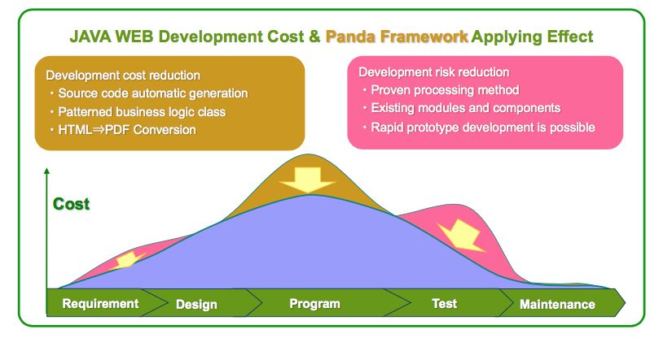
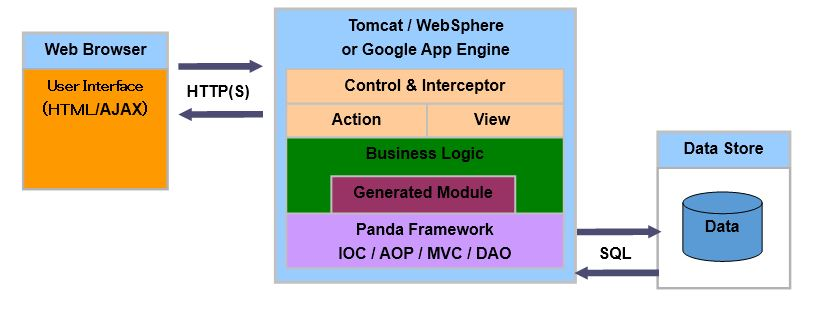
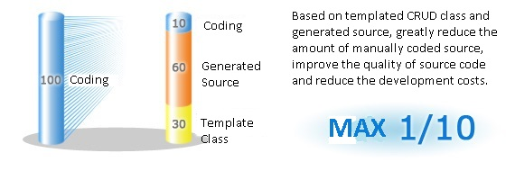
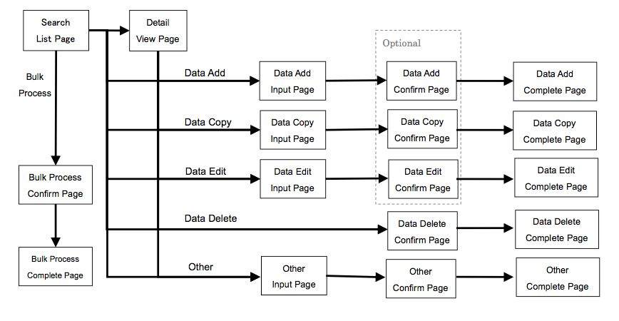
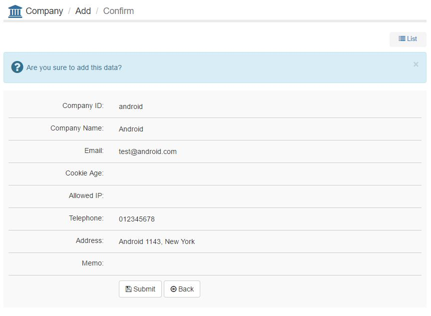
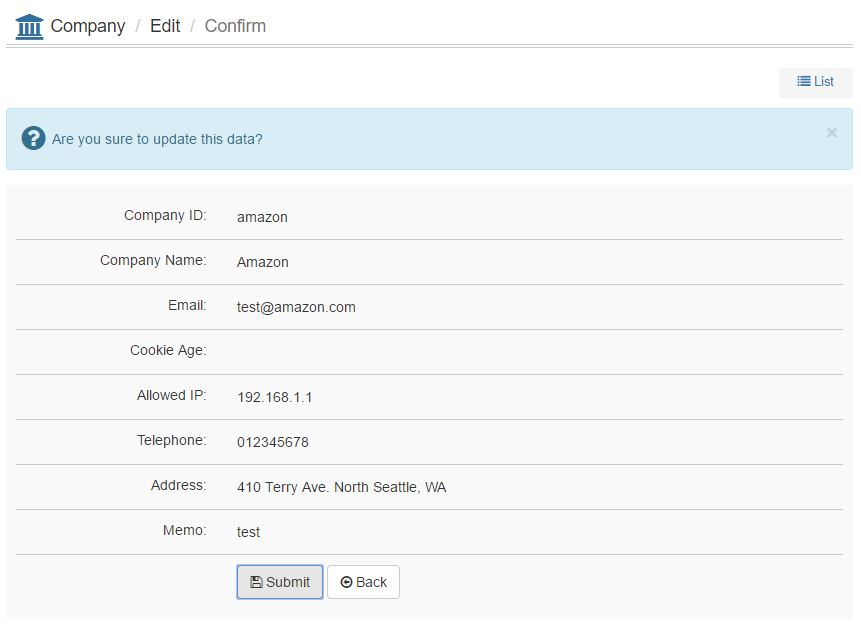
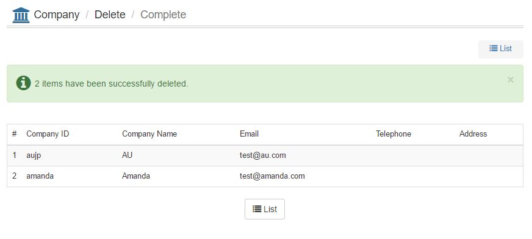

 Panda Framework
=================

## Outline
Panda Framework is an elegant, extensible framework for creating enterprise-ready Java Web applications. 
The framework is designed to streamline the full development cycle, from designing to building, to deploying, to maintaining applications over time. 
Comparing to popular Java application frameworks such as Spring/Struts2/Hibernate, Panda Framework is small and complete, easy to use, and easy to develop.

## Features
1. Automatic generation of the source code
The Panda Framework Code Generator can automatically generate the source of Action / Dao / Bean / View. The cost of development can be significantly reduced.

2. Writing SQL is not needed 
Use the API provided by Panda Framework, a programmer does not need to write SQL statements, can easily execute query / insert/ update / delete function based on a database table. It is easy to extend the Panda Framework’s base class to achieve some special purpose. So, it can improve the quality of source code and reduce the bugs. 

3. HTML Page ⇒ PDF Convert Feature

4. Business Logic Development is Easy
Using template class to develop Search/List/View/Add/Update/Delete function is very easy and fast. 

5. Improve productivity and source quality
Base on the generated source, the source quality and program productivity can be significantly improved. 

6. Easy to use
We provide a rich set of documents and samples to reduce initial cost from introduction to development.

## Panda Framework Applying Effect 
By applying Panda Framework, effective development and operation maintenance can be achieved. 

## System Architecture

## Modules
Panda Framework consists of the following modules.

 | Module                         | Description                                                               |
 |--------------------------------|---------------------------------------------------------------------------|
 | [panda-core](core/index_en.md) | This is the most basic part of the Panda framework and it contains many useful classes similar to apache-commons.  |
 | [panda-gear](gear/index_en.md) | [IOC](gear/ioc/ioc_en.md)/[MVC](gear/mvc/mvc_en.md) module. Similar to Spring-MVC, Struts2, contains some commonly used taglib. |
 | [panda-glue](glue/index_en.md) | [ASM](glue/asm_en.md)/[AOP](glue/aop_en.md) module.                  |
 | [panda-html](html/index_en.md) | Contains jQuery, Bootstrap, and the css/javascript required by panda-gear's taglib. |
 | [panda-pump](pump/index_en.md) | Extension module. Contains basic template classes that implement CRUD, user authentication, and some other useful classes. |
 | [panda-tool](tool/index_en.md) | Source code generator. Can generate Entity/Query/Dao/Action class, Freemarker (HTML) template file. |
 | [panda-tube](tube/index_en.md) | Web Service API client (WordPress XMP-RPC, Google Vision API).                     |

## Code Generator

### About the code generator
By using the Code Generator of Panda Framework, programmers do not need to write source code & SQL statements. 
Just define the database table structure and the user interface layout, 
and let Code Generator automatically generate source code to achieve the data search / list(sort, paging) & record view / insert / update / delete functions based on a database table. 
Greatly reduce the amount of manually coded source, improve the quality of source code and reduce the development costs.

### The effect of code generator

### Generated features by code generator
Code generator can generate the following features. And it is easy to customize.

 | No. | Feature                | Description |
 |-----|------------------------|-------------|
 | 1   | Search                 | Search/Query form.                 |
 | 2   | List View              | Search result list view.           |
 | 3   | List Print View        | Search result list view for print. |
 | 4   | Data Detail View       | Data detail view page.             |
 | 5   | Data Detail Print View | Data detail view page for print.   |
 | 6   | Data Add               | Data add feature.                  |
 | 7   | Data Copy              | Data duplicate feature.            |
 | 8   | Data Edit              | Data edit feature.                 |
 | 9   | Data Delete            | Data delete feature.               |
 | 10  | Data Export            | Export data to CSV/XLS file.       |
 | 11  | Data Import            | Import data from CSV/XLS file.     |
 | 12  | Bulk Data Process      | Process multiple data.             |

### Generated web page transition diagram

### Screenshot of generated source

#### List/Search Page

#### Detail View Page

#### Data Add Page

#### Data Add Confirm Page

#### Data Add Complete Page

#### Edit Page

#### Edit Confirm Page

#### Edit Complete Page

#### Delete Confirm Page

#### Delete Complete Page

#### Bulk Delete Confirm Page

#### Bulk Delete Complete Page

Some thoughts
---------------------------

Perhaps the biggest highlight of Panda Framework is the panda-tool source code generator.

Many programmers who do web application development will find that many pages function is nothing more than "list / create / update / delete" these four patterns.
A lot of code is written repeatedly, annoying and tired. So I just want to develop a source code generator to generate the code I need through an XML definition file.

The first version source code generator developed several years ago can generate source based on Struts2/iBatis2. 
But there are many features can not be implement easily by that Struts2/iBatis2. 
At that time, I meet the Nutz framework developed by Wenda. A small compact framework that can implement the features of Spring / Hibernate.
I am sorry for borrowed some of Nutz's API design, modified it and wrote my own implementation.

Having persisted in writing for several years, I finally completed a framework that I was satisfied with. 
It can implement some very common features of Spring/Struts2/Hibernate. 
The source code generator can generate the source code (including HTML pages and server side logic) implements the CRUD features.

I made a [DEMO website](http://pandafw.ga). Through this DEMO, you may understand the Panda Framework more intuitively.

I would be very grateful for that if you think the Panda Framework is easy to use and can help your work well.
Leave a suggestion or write a bug report, welcome to Folk.

